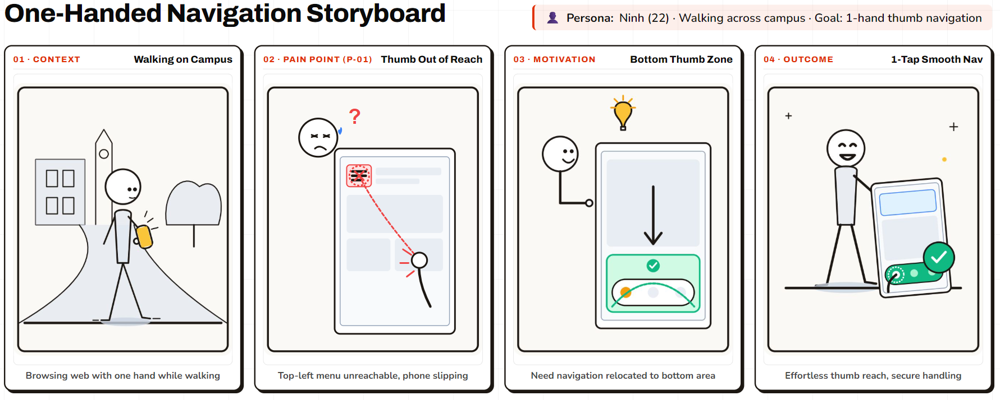
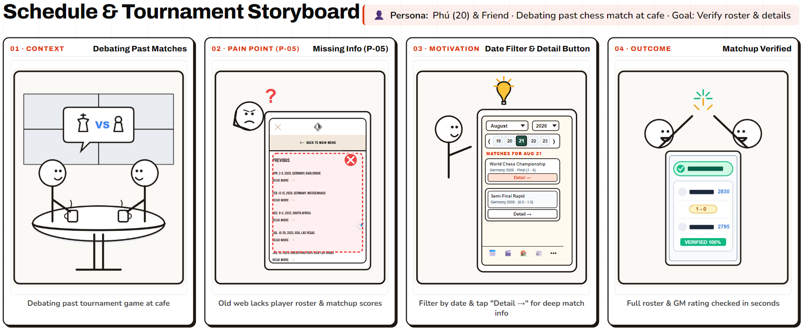

# PA3 Report — Requirement 1: Paper prototype & storyboarding

## Freestyle Chess Mobile Web — Group 06

**Course:** CSC13112 - UI/UX Design
**Lecturer:** Dr. Le Khanh Duy
**Teaching Assistant / Instructor:** MSc. Pham Nguyen Son Tung
**Assignment:** Project Assignment 3 (PA3) — Paper Prototype & Formative Testing
**Product Scope:** Freestyle Chess Mobile Website on Smartphone Browser

---

## 1. Paper prototypes

The YouTube link demonstrate the paper prototype of the Freestyle Chess Mobile Web application.

### P-01: Navigation

- Solution 1 (Nav-1): [www.youtube.com/watch?v=4N_84cMogyM](https://www.youtube.com/watch?v=4N_84cMogyM)
- Solution 2 (Nav-2): [www.youtube.com/watch?v=Q5gfn82XYN8](https://www.youtube.com/watch?v=Q5gfn82XYN8)
- Solution 3 (Nav-3): [www.youtube.com/watch?v=rhPUcRdJXbg](https://www.youtube.com/watch?v=rhPUcRdJXbg)

### P-05: Schedule

- Solution 1 (Sch-1): [www.youtube.com/watch?v=4UD-d60VP3w](https://www.youtube.com/watch?v=4UD-d60VP3w)
- Solution 2 (Sch-2): [www.youtube.com/watch?v=UxA8xizhQCk](https://www.youtube.com/watch?v=UxA8xizhQCk)
- Solution 3 (Sch-3): [www.youtube.com/watch?v=VmPB0yCTp2o](https://www.youtube.com/watch?v=VmPB0yCTp2o)

## 2. Storyboarding

### Storyboard 1: Navigation

### Storyboard 2: Schedule
