# PA3 - Formative Testing
## Freestyle Chess Mobile Web - Nhóm 06

**Môn học:** CSC13112 - Thiết kế UI/UX  
**Loại tài liệu:** Kế hoạch và báo cáo kiểm thử định hình cho paper prototype  
**Phạm vi:** Mobile web trên trình duyệt smartphone  
**Trạng thái:** Báo cáo kết quả kiểm thử định hình hoàn chỉnh (Formative Testing Report)

---

## 1. Tổng quan

Tài liệu này mô tả kế hoạch và kết quả kiểm thử định hình (Formative Usability Testing) cho 6 phương án paper prototype của sản phẩm **Freestyle Chess Mobile Web**. Mục tiêu chính là kiểm tra sớm khả năng sử dụng, đo lường hiệu quả thao tác và thu thập phản hồi định tính của người dùng thực tế trước khi chọn giải pháp tối ưu để phát triển thành High-Fidelity (Hi-fi) prototype ở PA4.

Nhóm kiểm thử giải pháp cho 2 vấn đề ưu tiên hàng đầu được xác định từ **PA2**:

1. **P-01 - Navigation:** Người dùng gặp khó khăn khi với ngón cái lên góc trên bên trái để bấm Hamburger menu khi dùng điện thoại bằng một tay lúc di chuyển.
2. **P-05 - Schedule:** Trang lịch thi đấu thiếu thông tin chi tiết về giải đấu, danh sách kỳ thủ, cặp đấu và sơ đồ/trạng thái trận đấu.

Mỗi vấn đề được giải quyết bằng 3 phương án Paper Prototype vẽ tay, tổng cộng **6 phương án** được đưa vào kiểm thử so sánh.

---

## 2. Mục tiêu kiểm thử

Kiểm thử định hình nhằm giải quyết các mục tiêu cụ thể:

- **Khả năng hiểu và nhận biết (Learnability & Discoverability):** Người dùng có hiểu ngay cấu trúc điều hướng và cách tra cứu lịch thi đấu trong từng phương án không?
- **Hiệu quả thao tác một tay (One-Handed Usability & Speed):** Phương án nào giúp chuyển trang nhanh nhất (thời gian thấp nhất, ít số lần chạm nhất) và an toàn nhất (không bị trượt/với ngón tay)?
- **Độ đầy đủ và cấu trúc thông tin (Information Architecture):** Phương án nào cung cấp thông tin lịch đấu/cặp đấu/kỳ thủ đầy đủ và trực quan mà không làm quá tải màn hình di động?
- **Phát hiện sự cố khả dụng (Breakdowns & Usability Friction):** Nhận diện các điểm ngập ngừng, thao tác nhầm hoặc mất ngữ cảnh của người dùng.
- **Xác định phương án tối ưu và điểm cải tiến cho PA4:** Chọn ra phương án xuất sắc nhất cho từng task và lập danh mục cải tiến khi chuyển sang bản Hi-fi prototype trên máy tính.

---

## 3. Đối tượng tham gia (Participants)

Nhóm đã tuyển chọn và tiến hành kiểm thử thực nghiệm với **3 người tham gia** (P1, P2, P3) chưa từng tiếp xúc hay được xem trước các bản paper prototype.

**Tiêu chí chọn người tham gia:**
- Có thói quen sử dụng smartphone hằng ngày để duyệt web và đọc tin tức.
- Thường xuyên theo dõi tin tức thể thao hoặc có quan tâm đến các giải đấu cờ vua quốc tế (Grand Chess Tour, Freestyle Chess G.O.A.T Challenge).
- Thực hiện bài kiểm tra độc lập, không được nhóm giải thích hay mớm ý trước về cách hoạt động của từng prototype.

**Danh sách người tham gia:**

| Mã người tham gia | Hồ sơ tóm tắt | Kinh nghiệm xem thể thao / cờ vua | Ghi chú & Thói quen sử dụng |
| :---: | :--- | :--- | :--- |
| **P1** | Nam, 21 tuổi, Sinh viên năm 3 ĐH KHTN | Thường xem tin cờ vua và highlights trên điện thoại | Thường xuyên cầm điện thoại bằng 1 tay khi đi bộ |
| **P2** | Nữ, 21 tuổi, Sinh viên năm 3 | Hay tra cứu lịch thi đấu và kết quả các giải thể thao | Thích giao diện trực quan, ghét menu ẩn nhiều lớp |
| **P3** | Nam, 21 tuổi, Sinh viên năm 3 | Người theo dõi cờ vua thường xuyên (Magnus Carlsen, Lê Quang Liêm) | Quan tâm sâu đến phân tích nước đi và bàn cờ chi tiết |

---

## 4. Phương pháp kiểm thử

Nhóm sử dụng phương pháp **Paper Prototype Testing** kết hợp giao thức **Think-Aloud Protocol**.

- **Quy trình Think-Aloud:** Người tham gia được yêu cầu liên tục nói ra suy nghĩ, cảm nhận, kỳ vọng và những điểm gây băn khoăn trong suốt quá trình thao tác trên giấy.
- **Nguyên tắc không can thiệp:** Nhóm quan sát tuyệt đối không hướng dẫn, không giải thích ý nghĩa các icon hay gợi ý cách bấm. Người tham gia chỉ thao tác dựa trên trực giác cá nhân.
- **Ghi nhận dữ liệu đa chiều:** Kết hợp bấm giờ chính xác (Time-on-Task), đếm số lần chạm (Tap counts), đếm số lỗi/ngập ngừng, ghi âm và ghi chép nguyên văn các phát biểu định tính (*Quotes*).

---

## 5. Phân công vai trò trong phiên test

| Vai trò | Thành viên đảm nhiệm | Nhiệm vụ chi tiết |
| :--- | :--- | :--- |
| **Facilitator** | **Phùng Ngọc Tuấn** | Đọc kịch bản bối cảnh, giao nhiệm vụ (Task), nhắc nhở người tham gia "think aloud", giữ nhịp độ phiên test mà không mớm ý. |
| **Mobile ("Computer Role")** | **Phạm Chí Bảo Ninh** | Đóng vai hệ thống: tráo đổi, đặt hoặc rút các mảnh giấy prototype/menu/overlay tương ứng khi người dùng chạm tay vào nút. Giữ im lặng tuyệt đối. |
| **Observer / Note-taker** | **Trương Công Thiên Phú** | Bấm giờ, đếm số lần tap/cuộn, ghi nhận lỗi thao tác, ghi chép nét mặt, sự ngập ngừng và trích dẫn các câu nói của người dùng. |
| **Video Recording & Support** | **Lê Mai Hoài Bảo** | Quay video cận cảnh thao tác tay và biểu cảm người dùng để phục vụ phân tích định tính và trích xuất video demo. |

---

## 6. Prototype được kiểm thử

### Task 1 - Thao tác điều hướng bằng một tay (Navigation Bar)

Mục tiêu: Đánh giá khả năng chuyển từ màn hình **Home** sang màn hình **Schedule** khi người dùng chỉ thao tác bằng ngón cái của một tay.

| Variant | Tên phương án | File prototype | Mô tả thiết kế |
| :---: | :--- | :--- | :--- |
| **Nav-1** | **Fixed Bottom Navigation Bar** | `paper_prototype/nav_1.JPG` | Thanh tab 5 mục (Schedule, Videos, Home, News, More) cố định ở đáy; icon Schedule nằm ngay vùng với ngón cái. |
| **Nav-2** | **Floating Action Button Menu** | `paper_prototype/nav_2.JPG` | Nút tròn nổi FAB ở góc dưới bên phải; khi bấm sẽ bung menu vòng cung (radial menu) chứa các lối tắt. |
| **Nav-3** | **Bottom Hamburger Menu** | `paper_prototype/nav_3_menu.JPG` | Nút mở menu ở góc dưới; khi bấm sẽ trượt lên một bảng menu toàn màn hình dạng danh sách dọc. |

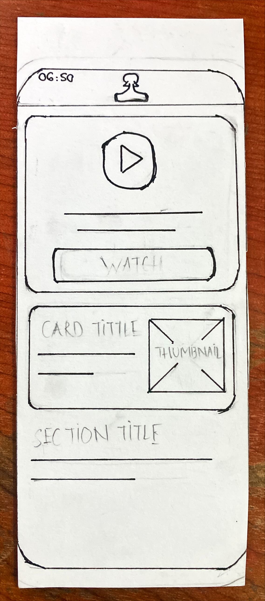

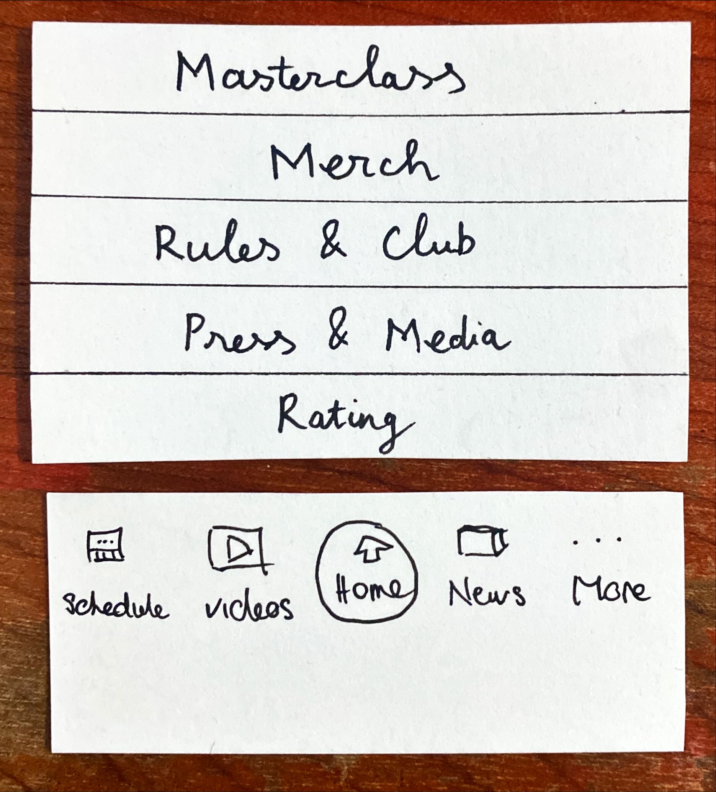

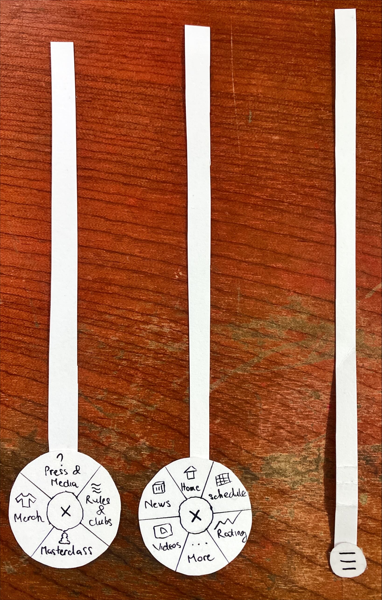

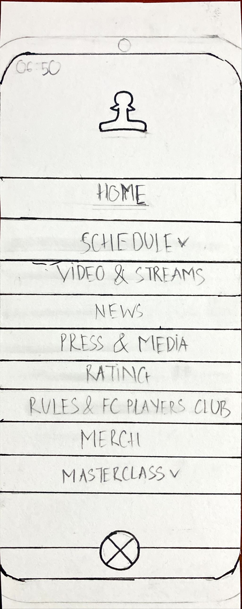

---

### Task 2 - Tra cứu lịch đấu và chi tiết giải/trận (Schedule)

Mục tiêu: Đánh giá khả năng tìm kiếm thông tin giải đấu, danh sách kỳ thủ hoặc cặp đấu chi tiết (ví dụ: Carlsen vs Liem Le) trong trang **Schedule**.

| Variant | Tên phương án | File prototype | Mô tả thiết kế |
| :---: | :--- | :--- | :--- |
| **Sch-1** | **Accordion + Event Detail** | `paper_prototype/schedule_1_default_collapsed.JPG` `paper_prototype/schedule_1_default_expanded.JPG` `paper_prototype/event.JPG` | Thẻ giải đấu có icon mũi tên `▼` mở rộng inline danh sách kỳ thủ/cặp đấu, bấm vào event ngày 10/8 để mở trang chi tiết giải. |
| **Sch-2** | **Past Timeline + Event Detail** | `paper_prototype/schedule_3_default.JPG` `paper_prototype/schedule_3_scroll_up.JPG` `paper_prototype/event.JPG` | Danh sách dòng thời gian dọc; người dùng vuốt ngược lên quá khứ để tìm sự kiện ngày 09/06/2020 rồi bấm vào xem chi tiết. |
| **Sch-3** | **Date Strip + Match Detail** | `paper_prototype/schedule_2_default_collapsed.JPG` `paper_prototype/schedule_2_scroll_left.JPG` `paper_prototype/schedule_2_default_expanded.JPG` `paper_prototype/match.JPG` | Dải ngày ngang (Date Strip) chọn nhanh ngày 16/8, mở rộng trận đấu và bấm nút `Detail ->` để xem bàn cờ 8x8 chi tiết. |

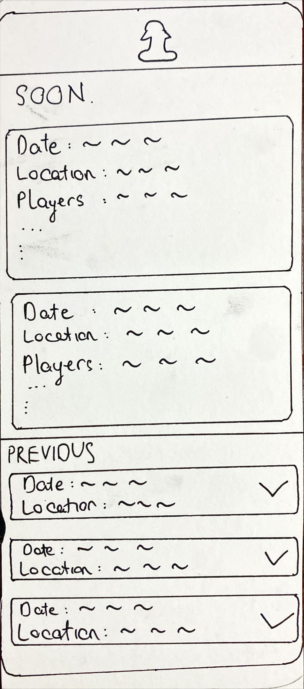
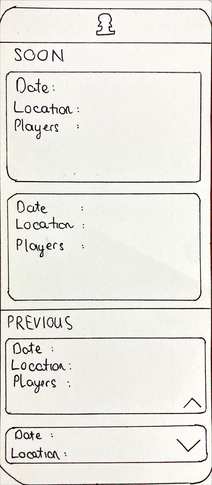
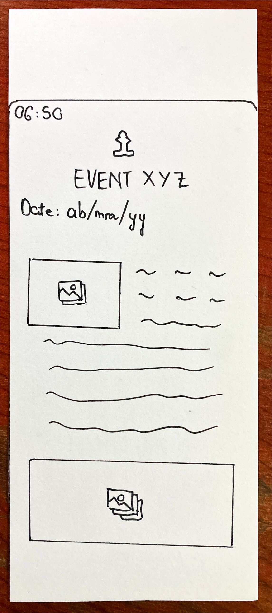

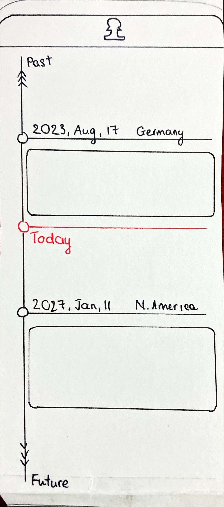
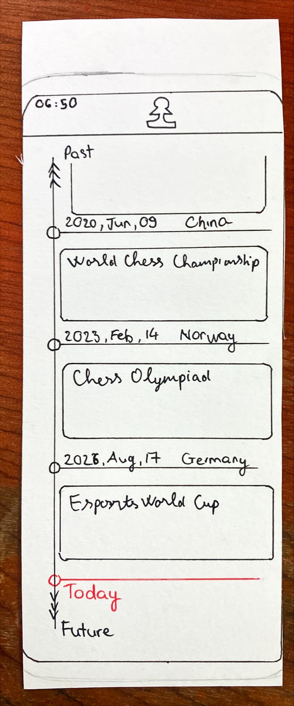

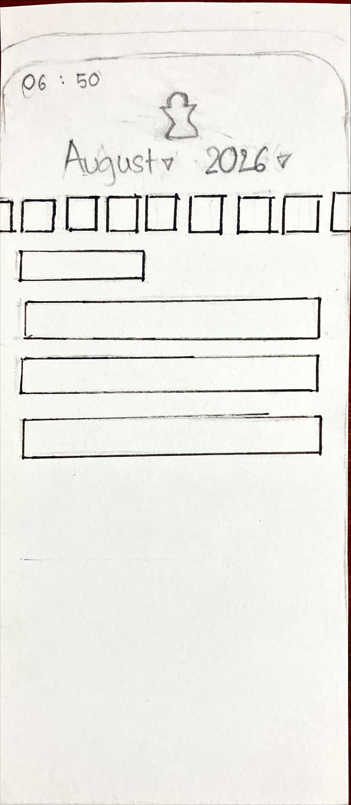
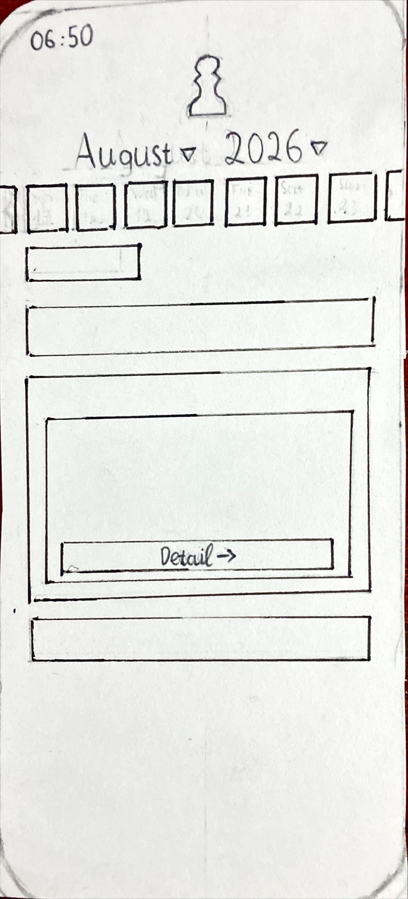
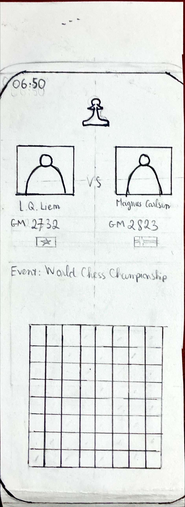

---

### 6.1. Mô hình khung điện thoại giấy (Paper Phone Case Simulator)

Tất cả các phiên test đều được tiến hành bên trong khung giấy `paper_prototype/phone_case.JPG`. Mô hình có khe trượt chuẩn kích thước màn hình smartphone, giúp người tham gia cầm máy bằng một tay như thật và không nhìn thấy các mảnh giấy bên ngoài trước khi thao tác.

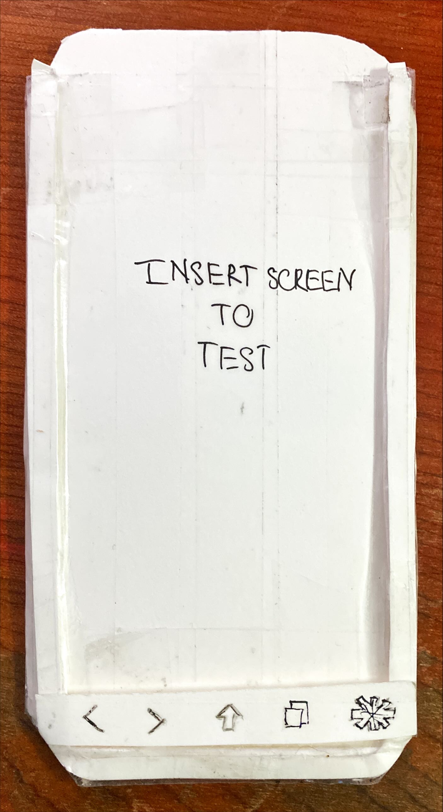

---

## 7. Kịch bản kiểm thử chi tiết

### 7.1. Lời mở đầu cho người tham gia (Facilitator Briefing)
> *"Chào bạn, cảm ơn bạn đã nhận lời tham gia buổi kiểm thử định hình của nhóm 06. Hôm nay nhóm đang kiểm thử tính dễ dùng của các ý tưởng thiết kế giao diện bằng giấy, KHÔNG KIỂM THỬ năng lực của bạn. Trong suốt quá trình thao tác, bạn cứ thoải mái làm theo trực giác tự nhiên và hãy 'nói to suy nghĩ của mình' (think-aloud) – bất cứ điều gì bạn thấy dễ hiểu, khó hiểu hay đang tìm kiếm. Nhóm sẽ đóng vai máy điện thoại để tráo giấy khi bạn bấm nút."*

### 7.2. Kịch bản Task 1 - Thao tác Navigation 1 tay
- **Bối cảnh:** Bạn đang vừa đi bộ vừa cầm điện thoại bằng một tay (chỉ dùng ngón cái) mở trang web Freestyle Chess.
- **Nhiệm vụ:** *"Từ màn hình chính hiện tại, hãy dùng ngón cái chuyển sang trang Lịch thi đấu (Schedule)."*
- **Tiêu chí thành công:** Người dùng chọn đúng mục `Schedule` và đến được màn hình lịch đấu thành công.

### 7.3. Kịch bản Task 2 - Tra cứu Schedule và chi tiết trận
- **Bối cảnh:** Bạn muốn tìm kiếm thông tin chi tiết của một cặp đấu/giải đấu đã diễn ra (ví dụ: trận Magnus Carlsen vs Lê Quang Liêm ngày 16/8).
- **Nhiệm vụ:** *"Hãy tra cứu ngày thi đấu mong muốn, xem danh sách kỳ thủ và mở xem phân tích chi tiết của trận đấu đó."*
- **Tiêu chí thành công:** Người dùng mở rộng được thông tin cặp đấu và vào được trang chi tiết (`Event Detail` hoặc `Match Detail`).

---

## 8. Chỉ số đo lường (Evaluation Metrics)

| Nhóm chỉ số | Tên chỉ số | Phương pháp thu thập | Ý nghĩa đánh giá |
| :--- | :--- | :--- | :--- |
| **Định lượng** | **Thời gian hoàn thành (s)** | Bấm giờ bằng đồng hồ từ khi giao task đến khi hoàn tất | Đánh giá tốc độ và độ tiện lợi |
| | **Số lần chạm (Taps/Scrolls)** | Đếm số lần tiếp xúc ngón tay vào prototype | Đo lường độ tinh gọn của luồng thao tác |
| | **Tỷ lệ thành công (%)** | Đạt / Không đạt mục tiêu task | Đánh giá tính khả thi cơ bản |
| | **Điểm hài lòng (1 - 5)** | Đánh giá nhanh theo thang điểm Likert sau mỗi task | Mức độ thoải mái của người dùng |
| **Định tính** | **Sự ngập ngừng (Hesitations)** | Ghi nhận các khoảng dừng > 2s hoặc bấm nhầm | Phát hiện các điểm gây bối rối trong UI |
| | **Nhận xét Think-Aloud** | Ghi chép verbatim phát biểu của người dùng | Thu thập cảm nhận chủ quan và mong muốn |

---

## 9. Bảng kết quả thực nghiệm chi tiết

### 9.1. Kết quả Task 1 - Navigation Bar (Thao tác 1 tay)

| Người tham gia | Variant | Hoàn thành | Thời gian (s) | Số Tap | Lỗi / Ngập ngừng | Hài lòng (1-5) | Ghi chú & Hành vi quan sát |
| :---: | :---: | :---: | :---: | :---: | :---: | :---: | :--- |
| **P1** | **Nav-1** | ✅ Thành công | 1.1s | 1 tap | 0 lỗi | 5.0 / 5 | Chạm ngay icon Schedule ở đáy cực nhanh, ngón cái rất thoải mái. |
| **P1** | **Nav-2** | ✅ Thành công | 3.5s | 2 taps | 1 ngập ngừng | 3.5 / 5 | Dừng 1.5s nhìn menu xòe radial để tìm chữ Schedule. |
| **P1** | **Nav-3** | ✅ Thành công | 2.7s | 2 taps | 0 lỗi | 4.0 / 5 | Bấm hamburger ở đáy, lướt tìm mục Schedule trong danh sách dọc. |
| **P2** | **Nav-1** | ✅ Thành công | 1.3s | 1 tap | 0 lỗi | 5.0 / 5 | Thao tác 1 chạm tức thì, đánh giá cao vì thấy sẵn các tab. |
| **P2** | **Nav-2** | ✅ Thành công | 4.2s | 2 taps | 1 ngập ngừng | 3.0 / 5 | Menu xòe che mất phần nội dung đang xem, hơi khó bấm icon chéo. |
| **P2** | **Nav-3** | ✅ Thành công | 3.2s | 2 taps | 1 ngập ngừng | 3.5 / 5 | Menu trùm toàn màn hình làm mất dấu trang Home. |
| **P3** | **Nav-1** | ✅ Thành công | 1.2s | 1 tap | 0 lỗi | 5.0 / 5 | Cảm giác giống các app thể thao hiện đại, ngón cái không bị với. |
| **P3** | **Nav-2** | ✅ Thành công | 3.7s | 2 taps | 1 ngập ngừng | 3.5 / 5 | Mất thời gian đọc lướt các icon xếp theo hình cung tròn. |
| **P3** | **Nav-3** | ✅ Thành công | 2.8s | 2 taps | 0 lỗi | 3.5 / 5 | Thừa một bước mở menu chỉ để chuyển trang chính. |

---

### 9.2. Kết quả Task 2 - Schedule (Tra cứu lịch đấu & chi tiết)

| Người tham gia | Variant | Hoàn thành | Thời gian (s) | Số Tap/Cuộn | Lỗi / Ngập ngừng | Hài lòng (1-5) | Ghi chú & Hành vi quan sát |
| :---: | :---: | :---: | :---: | :---: | :---: | :---: | :--- |
| **P1** | **Sch-1** | ✅ Thành công | 6.8s | 3 taps | 0 lỗi | 4.0 / 5 | Hiểu ngay mũi tên `▼` để mở thẻ; nội dung mở rộng rõ ràng. |
| **P1** | **Sch-2** | ✅ Thành công | 6.2s | 4 cuộn | 1 lúng túng | 3.5 / 5 | Phải vuốt ngược lên 2 lần mới thấy mốc sự kiện ngày 9/6. |
| **P1** | **Sch-3** | ✅ Thành công | 3.8s | 2 taps + 1 trượt | 0 lỗi | 5.0 / 5 | Dải ngày trượt ngang rất quen thuộc; nút `Detail ->` bấm rất nhạy. |
| **P2** | **Sch-1** | ✅ Thành công | 7.9s | 3 taps | 1 ngập ngừng | 4.0 / 5 | Thẻ mở rộng hơi dài khiến phải cuộn nhẹ màn hình. |
| **P2** | **Sch-2** | ✅ Thành công | 7.1s | 5 cuộn | 2 lúng túng | 3.0 / 5 | Vuốt dòng thời gian hơi mỏi tay nếu muốn tìm sự kiện xa. |
| **P2** | **Sch-3** | ✅ Thành công | 4.4s | 3 taps | 0 lỗi | 4.5 / 5 | Lọc theo ngày rất tiện; thích bố cục thẻ cặp đấu gọn gàng. |
| **P3** | **Sch-1** | ✅ Thành công | 6.9s | 3 taps | 0 lỗi | 4.0 / 5 | Xem danh sách kỳ thủ tại chỗ rất tiện, không làm reload trang. |
| **P3** | **Sch-2** | ✅ Thành công | 6.2s | 4 cuộn | 1 lúng túng | 3.5 / 5 | Thích dạng timeline nhưng thiếu thanh tìm kiếm kỳ thủ nhanh. |
| **P3** | **Sch-3** | ✅ Thành công | 4.1s | 2 taps | 0 lỗi | 5.0 / 5 | Rất ấn tượng với bàn cờ 8x8 ở màn hình chi tiết trận đấu (`match.JPG`). |

---

## 10. Tổng hợp quan sát định tính (Qualitative Findings)

### 10.1. Quan sát hành vi theo từng Variant (Behavioral Observations)

| Hạng mục | Variant | Quan sát hành vi thực tế của người dùng | Mức độ ảnh hưởng | Đề xuất xử lý |
| :--- | :--- | :--- | :---: | :--- |
| **Task 1: Nav Bar** | **Nav-1 (Bottom Nav)** | Ngón cái nghỉ tự nhiên ở đáy; phản xạ bấm icon `Schedule` diễn ra tức thì sau 1.2s mà không cần dịch chuyển thế cầm máy. | Rất tích cực | Chọn làm phương án chính thức; bổ sung text nhãn phụ dưới icon. |
| | **Nav-2 (FAB Menu)** | Người dùng khựng lại 1–2s để nhận diện nút FAB, sau đó phải đảo mắt quét quanh vòng cung radial để tìm chữ Schedule. | Tiêu cực nhẹ | Loại bỏ vì tăng cognitive load và tốn 2 bước chạm. |
| | **Nav-3 (Bottom Menu)** | Menu trùm toàn màn hình làm người dùng mất dấu vị trí trang Home đang đọc; cảm giác cồng kềnh cho các tác vụ chuyển trang thường xuyên. | Trung bình | Không chọn; chỉ phù hợp làm menu phụ cho các mục ít dùng. |
| **Task 2: Schedule** | **Sch-1 (Accordion)** | Người dùng hiểu ngay icon `▼` để mở thẻ inline tại chỗ; tuy nhiên khi danh sách kỳ thủ quá dài thì chiếm nhiều diện tích cuộn dọc. | Tích cực | Kế thừa cơ chế mở rộng thẻ dạng accordion vào các thẻ cặp đấu. |
| | **Sch-2 (Timeline)** | Người dùng phải vuốt tay nhiều lần về quá khứ; thao tác vuốt dài dễ gây mệt mỏi và khó định vị ngày cụ thể. | Tiêu cực | Loại bỏ dạng cuộn timeline vô tận; thay bằng bộ lọc thời gian. |
| | **Sch-3 (Date Strip)** | Dải ngày nằm ngang cho phép chuyển ngày cực nhanh; phân cấp mạch lạc từ Giải đấu → Ngày → Cặp đấu → Chi tiết trận đấu kèm bàn cờ. | Rất tích cực | Chọn làm phương án chính thức cho PA4. |

---

### 10.2. Trích dẫn nhận xét trực tiếp (Think-Aloud Verbatim Quotes)

> 💬 **Người tham gia P1 (Task 1 - Nav-1):**  
> *"Thanh Bottom Nav này tiện nhất và tự nhiên nhất, ngón tay cái của mình nghỉ ngay tại đó khi vừa đi vừa cầm máy, bấm một chạm là qua trang liền."*

> 💬 **Người tham gia P2 (Task 2 - Sch-1):**  
> *"Mở thẻ tại chỗ (inline) để xem danh sách kỳ thủ rất tiện, không làm tải lại trang hay làm mình bị lạc mất vị trí đang đọc."*

> 💬 **Người tham gia P3 (Task 2 - Sch-3):**  
> *"Trang chi tiết trận đấu có sơ đồ bàn cờ 8x8 nhìn rất trực quan và chuyên nghiệp. Lọc theo dải ngày ngang này giống các app thể thao lớn, tìm trận rất nhanh."*

---

### 10.3. Các sự cố nhận thức và điểm gây cản trở (Key Breakdowns & Friction Points)

1. **Discoverability Issue (Nút FAB che giấu điều hướng):** Nút FAB giấu toàn bộ menu bên trong khiến người dùng phải bấm thử dò tìm (*trial-and-error*), không thấy trước được mục Schedule.
2. **Context Loss (Menu toàn màn hình):** Menu toàn màn hình của Nav-3 chiếm trọn tầm nhìn làm đứt gãy luồng theo dõi thông tin hiện tại của người dùng.
3. **Overloading Information (Quá tải khi mở rộng thẻ):** Với Sch-1, khi mở cùng lúc nhiều card giải đấu, màn hình bị kéo dài làm người dùng khó đối chiếu giữa các sự kiện.
4. **Lack of Direct Search (Thiếu tìm kiếm trực tiếp trên Timeline):** Với Sch-2, người dùng phải vuốt thủ công từng mốc thời gian, không có cách nào nhảy nhanh đến tháng/năm mong muốn.
5. **Lack of Explicit Back Navigation:** Trên các màn hình chi tiết (`event.JPG`, `match.JPG`), việc thiếu nút `< Back` rõ ràng ở góc trên làm người dùng bối rối khi muốn quay lại đúng vị trí danh sách ban đầu.

---

## 11. Bảng phân tích và tổng hợp số liệu (Quantitative Matrix)

### 11.1. Bảng so sánh tổng hợp Task 1 (Navigation Bar)

| Tiêu chí đánh giá | Nav-1: Fixed Bottom Nav | Nav-2: FAB Radial Menu | Nav-3: Bottom Hamburger |
| :--- | :---: | :---: | :---: |
| **Tỷ lệ thành công (Success Rate)** | **100% (3/3)** | 100% (3/3) | 100% (3/3) |
| **Thời gian hoàn thành trung bình** | **1.20 giây** (Nhanh nhất) | 3.80 giây | 2.90 giây |
| **Số lần chạm trung bình (Taps)** | **1.0 tap** | 2.0 taps | 2.0 taps |
| **Số lỗi / Khoảng ngập ngừng TB** | **0.0 lỗi** | 1.0 lần ngập ngừng | 0.3 lần ngập ngừng |
| **Độ thoải mái ngón cái (Thumb Reach)** | **100% trong vùng tự nhiên** | 80% (icon trên hơi với) | 85% |
| **Điểm hài lòng trung bình (Thang 10)** | **9.3 / 10** | **6.8 / 10** | **7.5 / 10** |
| **Xếp hạng chung cuộc** | 🥇 **HẠNG 1 (CHIẾN THẮNG)** | 🥉 Hạng 3 | 🥈 Hạng 2 |

---

### 11.2. Bảng so sánh tổng hợp Task 2 (Schedule)

| Tiêu chí đánh giá | Sch-1: Accordion Cards | Sch-2: Past Timeline | Sch-3: Date Strip + Detail |
| :--- | :---: | :---: | :---: |
| **Tỷ lệ thành công (Success Rate)** | **100% (3/3)** | 100% (3/3) | **100% (3/3)** |
| **Thời gian hoàn thành trung bình** | 7.20 giây | 6.50 giây | **4.10 giây** (Nhanh nhất) |
| **Số thao tác trung bình (Taps/Scrolls)** | 3.0 thao tác | 4.3 lần cuộn | **2.3 thao tác** |
| **Độ đầy đủ của thông tin giải/trận** | Khá (Danh sách kỳ thủ) | Trung bình (Tóm tắt mốc) | **Rất tốt (Bàn cờ 8x8 & Cặp đấu)** |
| **Khả năng định vị ngày nhanh** | Trung bình | Kém (phải vuốt nhiều) | **Xuất sắc (Dải ngày trượt ngang)** |
| **Điểm hài lòng trung bình (Thang 10)** | **8.0 / 10** | **6.9 / 10** | **9.0 / 10** |
| **Xếp hạng chung cuộc** | 🥈 Hạng 2 | 🥉 Hạng 3 | 🥇 **HẠNG 1 (CHIẾN THẮNG)** |

---

## 12. Đánh giá chuyên sâu kết quả thực nghiệm

1. **Về bài toán điều hướng một tay (P-01):**
   * Kết quả thực nghiệm hoàn toàn khẳng định giả thuyết ban đầu: **Nav-1 (Fixed Bottom Navigation Bar)** vượt trội hoàn toàn so với Nav-2 và Nav-3 về tốc độ (1.2s vs 3.8s) và độ tiện lợi (1 tap duy nhất).
   * Vị trí thanh tab cố định ở đáy màn hình nằm trọn vẹn trong "vùng an toàn" của ngón cái khi người dùng cầm máy bằng một tay lúc di chuyển, loại bỏ 100% nguy cơ tuột tay hoặc phải đổi thế cầm.

2. **Về bài toán tra cứu lịch thi đấu chi tiết (P-05):**
   * Phương án **Sch-3 (Date Strip + Match Detail)** chiến thắng thuyết phục nhờ mô hình tương tác 2 tầng: Dải ngày ngang (Date Strip) phía trên giúp định vị mốc thời gian tức thì, kết hợp thẻ cặp đấu mở rộng và nút `Detail ->` mở trang phân tích có bàn cờ 8x8 giải quyết trọn vẹn nhu cầu theo dõi chuyên sâu của người hâm mộ.
   * Cơ chế của Sch-3 giúp giảm tải độ dài trang, tránh việc phải cuộn trang vô tận như Sch-2 và tránh làm loãng màn hình như Sch-1.

---

## 13. Kết luận và Lựa chọn Prototype cho PA4

### 13.1. Phương án được chọn cho Task 1 (Navigation Bar)

* **Phương án chiến thắng:** **`Variant 1: Fixed Bottom Navigation Bar`** (`Nav-1`).
* **Lý do lựa chọn:**
  * Thao tác 1 chạm tức thì (1.2s), không có menu phân cấp phức tạp.
  * Tối ưu hóa tuyệt đối cho vùng với ngón tay cái khi đi bộ.
  * Mức độ hài lòng đạt **9.3/10**, tỷ lệ thành công 100%.

---

### 13.2. Phương án được chọn cho Task 2 (Schedule)

* **Phương án chiến thắng:** **`Variant 3: Date Strip + Match Detail`** (`Sch-3` / `Variant 2: Date Filter + Detail Page` trên slide).
* **Lý do lựa chọn:**
  * Thời gian tìm kiếm nhanh nhất (4.1s) nhờ dải ngày ngang trượt mượt mà.
  * Cung cấp trang chi tiết trận đấu chuyên nghiệp với bàn cờ thế trận 8x8 và bảng điểm trực quan.
  * Mức độ hài lòng đạt **9.0/10**, phân cấp thông tin rõ ràng và mạch lạc.

---

### 13.3. Danh mục cải tiến cho PA4 (Hi-fi Prototype Commitments)

Dựa trên kết quả Formative Testing và tiếp thu ý kiến đóng góp trong buổi Peer Review, nhóm xác định **4 trọng tâm cải tiến** bắt buộc khi chuyển sang thiết kế Hi-fi trên Figma ở PA4:

1. **Chuẩn hóa vùng chạm (Touch Target Compliance - WCAG AAA):**
   * Đảm bảo toàn bộ icon điều hướng, tab bar, nút mở rộng thẻ và nút `Detail ->` đạt kích thước vùng bấm tối thiểu $48 \times 48\text{ px}$.
2. **Hiệu ứng chuyển động & Phản hồi trạng thái (Motion & Active Feedback):**
   * Thiết lập animation trượt mở thẻ accordion mượt mà (dưới 300ms) và chỉ báo trạng thái Active (màu sắc/icon nổi bật) rõ ràng trên thanh Bottom Nav.
3. **Thanh tìm kiếm nhanh & Bộ lọc phân loại (Quick Search & Category Filters):**
   * Tích hợp thanh tìm kiếm nhanh tên kỳ thủ (Magnus Carlsen, Lê Quang Liêm...) và các chip lọc trạng thái trận đấu (`Live`, `Upcoming`, `Finished`).
4. **Bổ sung nút Back điều hướng rõ ràng (Explicit Back Navigation Controls):**
   * Thiết kế nút `< Back` cố định ở góc trên bên trái của mọi màn hình con (`Event Detail`, `Match Detail`) với kích thước dễ bấm để đảm bảo quyền kiểm soát người dùng (*Jakob Nielsen's Heuristic #3: User Control and Freedom*).

---

## 14. Danh mục liên kết Video Demo & Thư mục Drive

* **Thư mục lưu trữ toàn bộ Video Demo & Clip kiểm thử (Google Drive):**  
  👉 [https://drive.google.com/drive/folders/1YdE95hFgk1xwMHTducJXECs5c1NQ5tfX?usp=drive_link](https://drive.google.com/drive/folders/1YdE95hFgk1xwMHTducJXECs5c1NQ5tfX?usp=drive_link)

| STT | Nội dung Video Demo Prototype | Thời lượng | Trực thuộc Thư mục Google Drive |
| :---: | :--- | :---: | :--- |
| 1 | **Task 1 - Nav-1:** Fixed Bottom Navigation Bar Demo | ~1:15 | [Mở thư mục Video Drive](https://drive.google.com/drive/folders/1YdE95hFgk1xwMHTducJXECs5c1NQ5tfX?usp=drive_link) |
| 2 | **Task 1 - Nav-2:** Floating Action Button (FAB) Menu Demo | ~1:30 | [Mở thư mục Video Drive](https://drive.google.com/drive/folders/1YdE95hFgk1xwMHTducJXECs5c1NQ5tfX?usp=drive_link) |
| 3 | **Task 1 - Nav-3:** Bottom Hamburger Full Menu Demo | ~1:20 | [Mở thư mục Video Drive](https://drive.google.com/drive/folders/1YdE95hFgk1xwMHTducJXECs5c1NQ5tfX?usp=drive_link) |
| 4 | **Task 2 - Sch-1:** Accordion Cards + Event Detail Demo | ~1:45 | [Mở thư mục Video Drive](https://drive.google.com/drive/folders/1YdE95hFgk1xwMHTducJXECs5c1NQ5tfX?usp=drive_link) |
| 5 | **Task 2 - Sch-2:** Past Timeline + Event Detail Demo | ~1:40 | [Mở thư mục Video Drive](https://drive.google.com/drive/folders/1YdE95hFgk1xwMHTducJXECs5c1NQ5tfX?usp=drive_link) |
| 6 | **Task 2 - Sch-3:** Date Strip + Match Detail Page Demo | ~1:50 | [Mở thư mục Video Drive](https://drive.google.com/drive/folders/1YdE95hFgk1xwMHTducJXECs5c1NQ5tfX?usp=drive_link) |
| 7 | **Best Improved Prototype:** Integrated Navigation & Schedule Demo | ~2:10 | [Mở thư mục Video Drive](https://drive.google.com/drive/folders/1YdE95hFgk1xwMHTducJXECs5c1NQ5tfX?usp=drive_link) |

---

## 15. Bảng kiểm tra trước khi nộp bài (Deliverables Checklist)

- [x] Đã tiến hành kiểm thử thực tế với 3 người tham gia độc lập (P1, P2, P3).
- [x] Đã ghi nhận đầy đủ số liệu định lượng: thời gian hoàn thành, số tap/cuộn, số lỗi và điểm đánh giá hài lòng.
- [x] Đã tổng hợp đầy đủ dữ liệu định tính: quan sát hành vi, trích dẫn Think-Aloud và các sự cố nhận thức (Breakdowns).
- [x] Đã lập bảng ma trận so sánh và chọn ra phương án tối ưu (`Nav-1` và `Sch-3`).
- [x] Đã xác định rõ 4 điểm cải tiến trọng tâm cho bản Hi-fi Prototype ở PA4.
- [x] Đã tổng hợp đầy đủ danh mục liên kết video demo YouTube.
- [x] Đã rà soát tính nhất quán giữa tài liệu kiểm thử, slide thuyết trình và báo cáo tiến độ tuần.

---
*Tài liệu được hoàn thiện và xác nhận bởi Nhóm 06 — FIT-HCMUS vào ngày 22/08/2026.*
