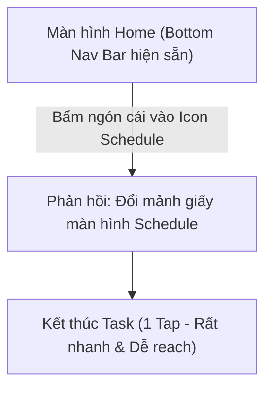
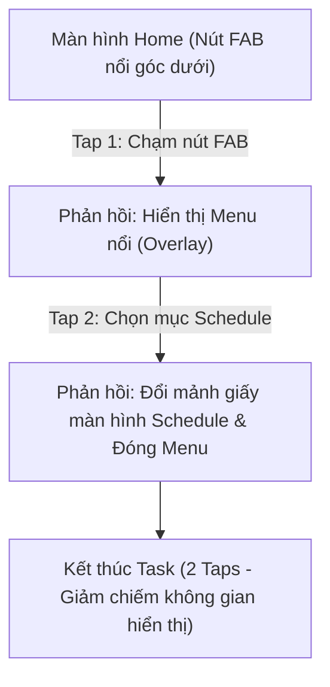
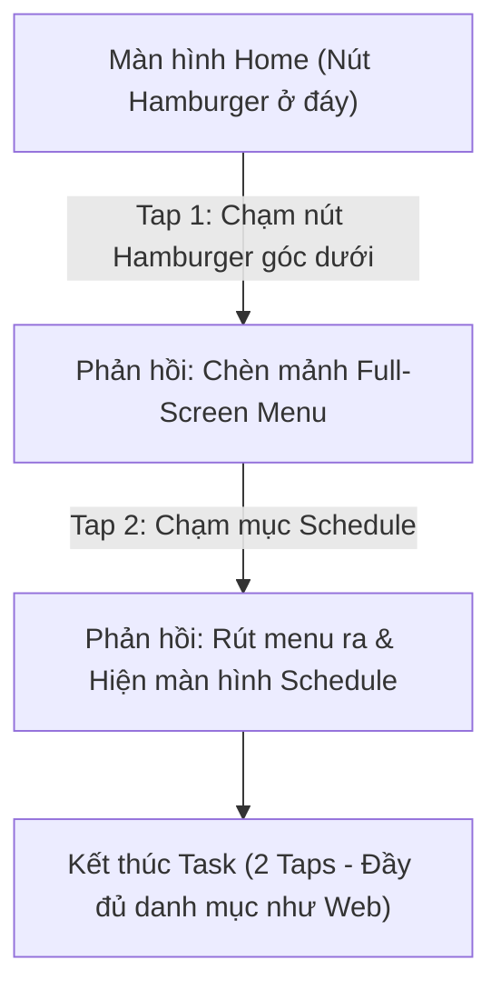
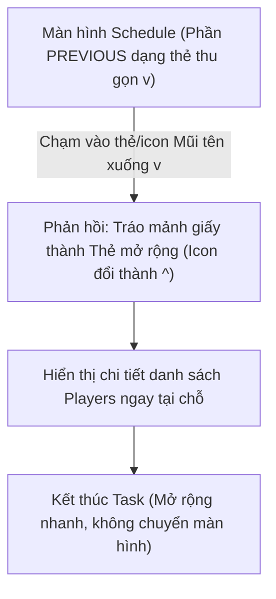
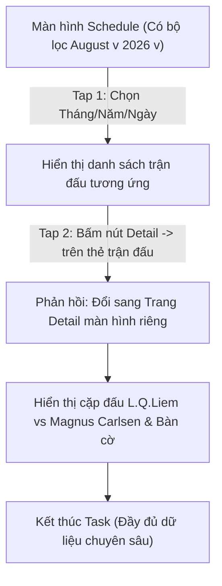
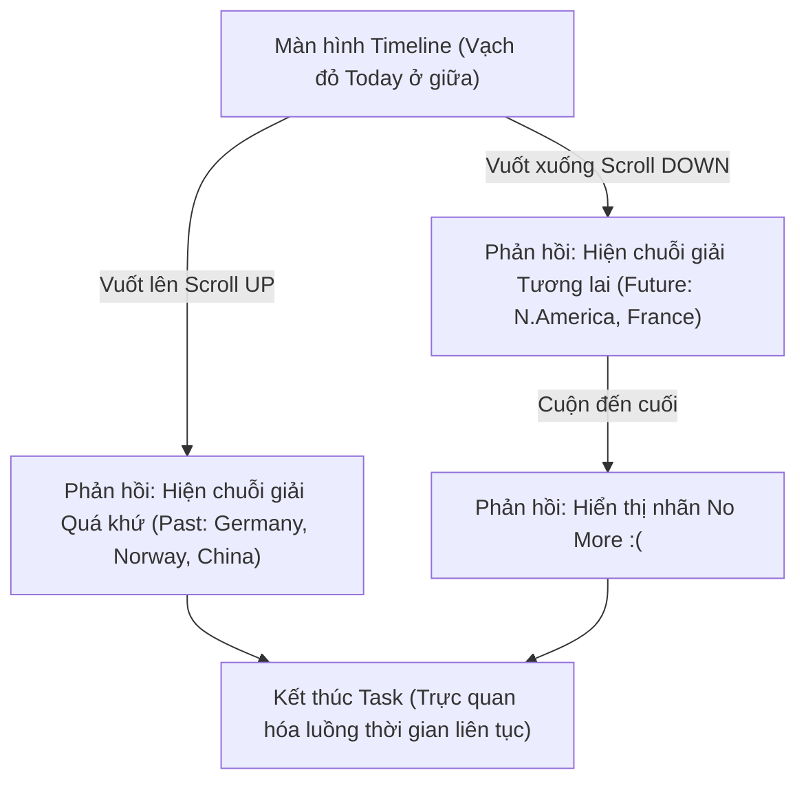

# THIẾT KẾ TASK WORKFLOW & USER FLOW (PA3 - FREESTYLE CHESS MOBILE WEB)

**Môn học:** CSC13112 - Thiết kế UI/UX (ThS. Phạm Nguyễn Sơn Tùng)  
**Nhóm thực hiện:** Nhóm 06  
**Phạm vi sản phẩm:** Freestyle Chess Mobile Web (Smartphone Browser)  
**Mục tiêu tài liệu:** Đặc tả chi tiết các luồng thao tác của người dùng (Task Workflows / User Flows) cho 2 kịch bản trọng tâm, áp dụng cho 6 phương án Paper Prototype nhằm phục vụ công tác Kiểm thử định hình (Formative Testing) và báo cáo PA3.

---

## I. TỔNG QUAN HỆ THỐNG TASK WORKFLOW

Dựa trên kết quả nghiên cứu người dùng và bảng xếp hạng điểm ưu tiên ở **PA2**, nhóm đã xác định 2 vấn đề lớn nhất cần giải quyết bằng Paper Prototype:

1. **Task 1 (Navigation Bar):** Giải quyết vấn đề **P-01** (Vị trí menu Hamburger góc trên bên trái gây khó khăn cho việc thao tác bằng 1 tay khi di chuyển).
2. **Task 2 (Schedule):** Giải quyết vấn đề **P-05** (Lịch thi đấu thiếu thông tin chi tiết về cặp đấu, thời gian, danh sách kỳ thủ `Players` và sơ đồ giải đấu).

Mỗi Task được thiết kế với **3 phương án Paper Prototype (3 Variants)** khác nhau để kiểm thử so sánh.

---

## II. TASK WORKFLOW 1: THAO TÁC ĐIỀU HƯỚNG BẰNG MỘT TAY (NAV BAR)

### 1. Kịch bản bài test (Test Scenario & Task)
* **Kịch bản người dùng (Scenario):** Người dùng vừa đi bộ vừa sử dụng điện thoại bằng một tay (chỉ dùng ngón tay cái) để lướt xem thông tin giải đấu Freestyle Chess. Họ muốn chuyển nhanh từ màn hình Trang chủ (Home) sang màn hình Lịch thi đấu (Schedule) hoặc Tin tức (News).
* **Nhiệm vụ (Task):** "Hãy sử dụng ngón tay cái của 1 tay để chuyển hướng từ màn hình hiện tại sang trang Schedule."

---

### 2. Chi tiết Workflow theo từng Phương án Paper Prototype

#### 🔹 Phương án 1: Fixed Bottom Navigation Bar (Thanh Nav Bar cố định ở đáy)
* **Cấu trúc UI:** Thanh Nav Bar 4-5 tab (Home, Schedule, Rating, Videos) cố định ở cạnh dưới màn hình.
* **Luồng thao tác (User Flow):**
  1. **Trạng thái ban đầu:** Người dùng đang ở Màn hình Home. Thanh Bottom Nav Bar hiển thị rõ ở đáy.
  2. **Thao tác người dùng:** Người dùng dùng ngón cái chạm trực tiếp vào icon `Schedule` trên Bottom Nav Bar.
  3. **Phản hồi hệ thống (Computer Role):** Đổi mảnh giấy màn hình chính sang màn hình `Schedule`. Icon `Schedule` trên thanh Nav Bar chuyển sang trạng thái Active (tô màu/nổi bật).
  4. **Điểm kết thúc:** Người dùng xem được nội dung trang Schedule chỉ sau **1 lần chạm**.

---

#### 🔹 Phương án 2: Floating Action Button - FAB (Nút nổi góc dưới)
* **Cấu trúc UI:** Một nút tròn nổi (FAB) nằm ở góc dưới bên phải màn hình.
* **Luồng thao tác (User Flow):**
  1. **Trạng thái ban đầu:** Màn hình Home hiển thị nút FAB ở góc dưới bên phải.
  2. **Thao tác 1:** Người dùng chạm ngón cái vào nút FAB.
  3. **Phản hồi hệ thống 1 (Computer Role):** Đặt thêm miếng dán mảnh menu dạng xòe/cung tròn (hoặc danh sách dọc nổi) chứa các lối tắt: `Home`, `Schedule`, `Rating`, `Videos`.
  4. **Thao tác 2:** Người dùng chọn ngón cái bấm vào mục `Schedule` trong menu vừa mở.
  5. **Phản hồi hệ thống 2:** Đổi màn hình chính sang `Schedule`, ẩn menu nổi FAB.
  6. **Điểm kết thúc:** Hoàn thành tác vụ sau **2 lần chạm**.

---

#### 🔹 Phương án 3: Bottom Hamburger Menu (Hamburger chuyển xuống đáy màn hình)
* **Cấu trúc UI:** Đưa biểu tượng Hamburger Menu từ góc trên-trái xuống góc dưới-trái/phải trong tầm với ngón cái.
* **Luồng thao tác (User Flow):**
  1. **Trạng thái ban đầu:** Màn hình Home với nút Hamburger nằm ở góc dưới.
  2. **Thao tác 1:** Người dùng chạm ngón cái vào nút Hamburger ở đáy.
  3. **Phản hồi hệ thống 1 (Computer Role):** Đặt mảnh giấy **Full-Screen Menu Overlay** đè lên toàn bộ màn hình (tương tự menu bản web cũ nhưng được kích hoạt từ đáy).
  4. **Thao tác 2:** Người dùng tìm và chạm vào dòng chữ `Schedule` trong danh sách menu Full-Screen.
  5. **Phản hồi hệ thống 2:** Rút mảnh Full-Screen Menu ra, hiển thị màn hình `Schedule`.
  6. **Điểm kết thúc:** Hoàn thành tác vụ sau **2 lần chạm**.

---

## III. TASK WORKFLOW 2: TRA CỨU CHI TIẾT LỊCH ĐẤU & GIẢI ĐẤU (SCHEDULE)

### 1. Kịch bản bài test (Test Scenario & Task)
* **Kịch bản người dùng (Scenario):** Một người hâm mộ cờ vua (chess follower) muốn tìm lại thông tin danh sách các kỳ thủ (`Players`) tham gia một giải đấu đã diễn ra trong quá khứ, hoặc xem thông tin chi tiết cặp đấu (như trận đấu giữa L.Q.Liem vs Magnus Carlsen).
* **Nhiệm vụ (Task):** "Hãy tìm giải đấu mong muốn và xem thông tin chi tiết danh sách các kỳ thủ/cặp đấu của giải đó."

---

### 2. Chi tiết Workflow theo từng Phương án Paper Prototype

#### 🔹 Phương án 1: Accordion / Collapsible Cards List (Mở rộng thẻ tại chỗ)
* **Cấu trúc UI:** Trang Lịch thi đấu chia làm 2 phần: **SOON** (Giải sắp tới) và **PREVIOUS** (Giải đã qua). Các thẻ trong mục PREVIOUS ban đầu thu gọn với icon Mũi tên xuống (`\v/`).
* **Luồng thao tác (User Flow):**
  1. **Trạng thái ban đầu:** Màn hình Lịch thi đấu hiển thị danh sách các giải đấu trong mục `SOON` (hiển thị sẵn `Date`, `Location`, `Players`) và `PREVIOUS` (các thẻ thu gọn chỉ có `Date`, `Location` + icon `\v/`).
  2. **Thao tác 1:** Người dùng cuộn màn hình xuống khu vực `PREVIOUS`.
  3. **Thao tác 2:** Chạm vào thẻ giải đấu cần xem (hoặc icon `\v/`).
  4. **Phản hồi hệ thống (Computer Role):** Thay mảnh thẻ thu gọn bằng mảnh thẻ **Mở rộng (Expanded Card)**: Icon đổi thành Mũi tên lên (`^`), dòng chi tiết `Players: ~~~` hiện ra ngay bên dưới thẻ.
  5. **Thao tác 3 (Tùy chọn):** Bấm nút `^` để thu gọn lại thẻ.
  6. **Điểm kết thúc:** Người dùng đọc được danh sách kỳ thủ ngay tại trang hiện tại mà không bị chuyển trang.

---

#### 🔹 Phương án 2: Date Dropdown Filter + Dedicated Detail Page (Lọc Ngày/Tháng + Trang Chi tiết riêng)
* **Cấu trúc UI:** Phía trên có 2 bộ lọc Dropdown `August v` và `2026 v`, cùng dải dán chọn Ngày. Mỗi thẻ trận đấu có nút bấm `Detail ->`. Khi bấm vào sẽ sang **Trang Detail riêng** có sơ đồ bàn cờ & cặp đấu.
* **Luồng thao tác (User Flow):**
  1. **Trạng thái ban đầu:** Màn hình Schedule với bộ lọc thời gian ở trên cùng.
  2. **Thao tác 1 (Lọc Tháng):** Người dùng chạm vào `August v`. 
     * *Phản hồi 1:* Đặt mảnh dán Dropdown danh sách các tháng (`August`, `September`,...). Người dùng chọn tháng mong muốn.
  3. **Thao tác 2 (Lọc Năm):** Người dùng chạm vào `2026 v`.
     * *Phản hồi 2:* Đặt mảnh dán Dropdown danh sách các năm (`2026`, `2027`,...). Người dùng chọn năm.
  4. **Thao tác 3 (Chọn Ngày):** Người dùng bấm chọn 1 ô ngày trên dải lịch ngang.
  5. **Thao tác 4 (Vào Detail):** Bấm vào nút `Detail ->` trên thẻ trận đấu.
  6. **Phản hồi hệ thống (Computer Role):** Thay toàn bộ màn hình sang **Trang Chi tiết trận đấu riêng (Dedicated Detail Screen)** hiển thị: Tên giải đấu (`World Chess Championship`), Thông tin cặp đấu (`L.Q.Liem GM 2732` VS `Magnus Carlsen GM 2823`), và Bàn cờ phân tích dạng lưới.
  7. **Điểm kết thúc:** Xem đầy đủ thông tin chuyên sâu của trận đấu trên trang riêng.

---

#### 🔹 Phương án 3: Vertical Interactive Infinite Timeline (Dòng thời gian dọc liên tục)
* **Cấu trúc UI:** Trục thời gian dọc chạy từ trên xuống. Trung tâm là vạch đỏ **Today** (Hôm nay). Vuốt lên trên (`Past`) để xem quá khứ, vuốt xuống dưới (`Future`) để xem tương lai.
* **Luồng thao tác (User Flow):**
  1. **Trạng thái ban đầu:** Màn hình hiển thị mốc vạch đỏ `Today` ở giữa, với 1 giải quá khứ gần nhất ở trên và 1 giải tương lai gần nhất ở dưới.
  2. **Thao tác xem Quá khứ (Past Flow):** Người dùng dùng ngón tay **Vuốt màn hình lên (Scroll UP)** hướng về mũi tên `Past`.
     * *Phản hồi:* Trượt trục thời gian xuống, vạch `Today` dịch xuống dưới, hiển thị chuỗi các giải đã đấu trong quá khứ (`2023, Aug, 17 Germany`, `2023, Feb, 14 Norway`, `2020, Jun, 09 China`).
  3. **Thao tác xem Tương lai (Future Flow):** Người dùng dùng ngón tay **Vuốt màn hình xuống (Scroll DOWN)** hướng về mũi tên `Future`.
     * *Phản hồi:* Trượt trục thời gian lên, vạch `Today` dịch lên trên, hiển thị các giải sắp tới (`2027, Jan, 11 N. America`, `2028, Mar, 27 France`).
  4. **Trạng thái hết dữ liệu:** Khi cuộn hết danh sách tương lai, màn hình hiển thị biểu tượng `No More :(`.
  5. **Điểm kết thúc:** Trải nghiệm cuộn thời gian liên tục 2 chiều mượt mà, trực quan.

---

## IV. BẢNG SO SÁNH CÁC PHƯƠNG ÁN & CHỈ SỐ ĐÁNH GIÁ (FORMATIVE TESTING METRICS)

Để phục vụ bài báo cáo **Yêu cầu 2: Formative Testing**, nhóm sẽ đo lường các chỉ số sau cho từng Task Workflow:

### 1. Đánh giá Task 1 (Nav Bar Workflow)
| Tiêu chí | Phương án 1 (Bottom Nav) | Phương án 2 (FAB Menu) | Phương án 3 (Bottom Hamburger) |
|---|---|---|---|
| **Số lượt chạm (Tap count)** | **1 Tap** (Tối ưu nhất) | 2 Taps | 2 Taps |
| **Độ dễ với ngón cái (Reachability)** | Rất cao (Tất cả tab ở đáy) | Rất cao (Nút FAB ở góc phải) | Cao |
| **Tải nhận thức (Cognitive Load)** | Thấp (Mọi tab hiện sẵn) | Trung bình (Cần bấm xem menu) | Cao hơn (Full screen overlay) |

### 2. Đánh giá Task 2 (Schedule Workflow)
| Tiêu chí | Phương án 1 (Accordion) | Phương án 2 (Date Filter + Detail) | Phương án 3 (Vertical Timeline) |
|---|---|---|---|
| **Tốc độ tra cứu nhanh** | Rất nhanh (Mở thẻ tại chỗ) | Trung bình (Cần qua 2-3 bước chọn) | Nhanh (Vuốt tự nhiên) |
| **Mức độ đầy đủ thông tin** | Vừa đủ (`Players`) | **Rất cao** (Có cặp đấu & bàn cờ) | Vừa đủ (Ngày, Quốc gia, Giải) |
| **Trải nghiệm tương tác** | Đơn giản, quen thuộc | Chuyên sâu, chuyên nghiệp | Độc đáo, trực quan hóa thời gian |

---

## V. QUY TRÌNH TIẾN HÀNH THỬ NGHIỆM ĐỊNH HÌNH (FORMATIVE TESTING PROCEDURE)

Khi thực hiện phiên test với 2-3 người dùng thật, các thành viên nhóm phân công vai trò theo chuẩn Paper Prototype:

1. **Facilitator (Người dẫn dắt):** Đọc kịch bản, giải thích quy trình, khuyến khích người dùng suy nghĩ thành lời (**Think-Aloud Protocol**).
2. **Computer (Người đóng vai Máy tính):** 
   - Đứng trực tiếp trước các mảnh giấy prototype.
   - Khi người dùng chạm vào nút/thẻ trên giấy, Computer nhanh chóng **thay/tráo/dán** các mảnh giấy tương ứng theo chính xác **Task Workflow** đã đặc tả ở trên.
   - Không được nói hoặc gợi ý cho người dùng.
3. **Observer / Note-taker (Người ghi chép & Quay phim):**
   - Đếm số lượt chạm (taps), đo thời gian hoàn thành task.
   - Ghi chép các sự cố tương tác (rage clicks, nhầm lẫn, ngập ngừng).
   - Tổng hợp phản hồi định tính để viết báo cáo điểm cần cải thiện cho PA4.
